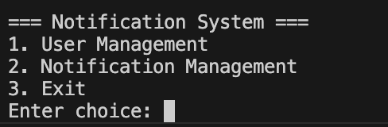
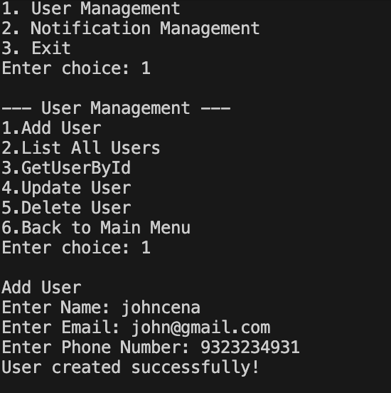
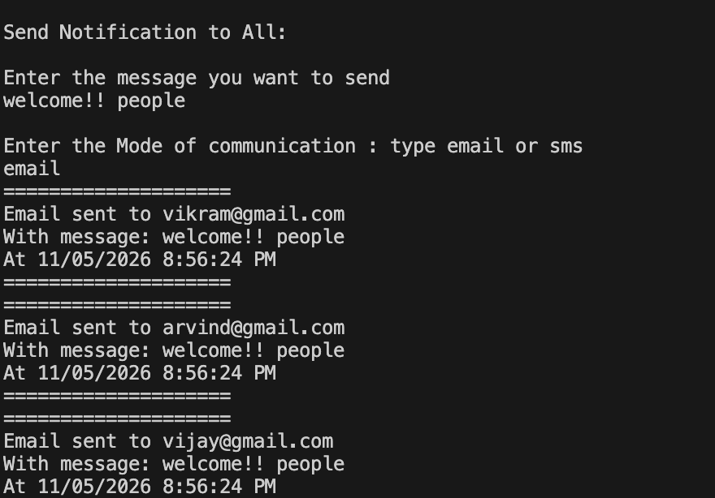

# Notification System

## to Run

1.  **Open Terminal** in the project root.
2.  **Navigate** to the Frontend library:
    ```bash
    cd NotifyFELibrary
    ```
3.  **Run** the application:
    ```bash
    dotnet run
    ```

## Output










