# Community Library Membership & Book Lending System

A C# .NET Core console application using Entity Framework Core and PostgreSQL to manage library operations.

## ER Diagram

[ER Diagram](ERDiagram.png)

### Table Relationships

* **Membership (1) to Member (Many):**  
  A membership tier can be assigned to multiple members.

* **Member (1) to Borrowing (Many):**  
  A member can borrow multiple books over time.

* **BookCategory (1) to Book (Many):**  
  A category can contain multiple books.

* **Book (1) to BookCopy (Many):**  
  A single book title can have multiple physical copies.

* **BookCopy (1) to Borrowing (Many):**  
  A physical copy can participate in multiple borrowing records over time.

* **Borrowing (1) to Fine (Many):**  
  A borrowing record can generate multiple fines such as late return fines or damage fines.

* **Member (1) to MembershipPayment (Many):**  
  A member can make multiple membership payments over time.

* **BookCopy (1) to BookDamageHistory (Many):**  
  A book copy can have multiple damage reports.

* **Member (1) to BookDamageHistory (Many):**  
  A member can be associated with multiple damage incidents.

---

### Many-to-Many Relationships

* **Member to BookCopy (Many-to-Many):**  
  Resolved through the `Borrowing` junction entity.

  - One member can borrow many book copies.
  - One book copy can be borrowed by many members over time.

---

### History Entity

* **BookDamageHistory:**  
  Acts as a damage tracking entity that records:
  
  - damaged copy
  - responsible member
  - severity
  - damage description
  - damage date

## Functional Requirements

### Member Functional Requirements

Note: For simplicity, App uses only email ID for login.

* Register as a new member with a name, email, and phone number.
* View personal profile and current active membership status.
* Purchase or upgrade to a membership tier (Basic, Student, Premium).
* Search the book catalog by Title/Author or by Category as separate features.
* View available books that have copies currently in stock.
* Borrow a book copy under active membership limits.
* View currently borrowed books and their due dates.
* Return a borrowed book.
* View and pay pending fines.

### Admin Functional Requirements
* Manage memberships by creating, viewing, updating, or deactivating tiers.
* Manage the book catalog by adding books and generating multiple physical book copies with unique copy numbers.
* Mark individual copies as Damaged and charge the member a fine based on severity (Low, Medium, High).
* View active damage history reports.
* Manage categories by adding, listing, updating.
* Manage members by deactivating them.
* Run administrative reports:
  * Books currently checked out.
  * Overdue book copy reports.
  * Members with active unpaid fines.
  * Most frequently borrowed books.
  * Total available books summarized by category.
  * Full borrowing history audit for any member.

## Important Logic and Application Outputs

### 1. Duplicate Borrowing Prevention
A member cannot borrow a duplicate copy of a book they already currently check out.
```text
Select an option: 5
--- Borrow a Book ---
Enter Book ID to borrow: 5
Failed to borrow: You have already borrowed this book and have not returned it yet.
```

### 2. Membership Tier Borrowing Limit Exceeded
Basic members are restricted to 2 active borrowings (7-day duration limit), Student to 3 (10-day duration limit), and Premium to 5 (15-day duration limit).
```text
Select an option: 5
--- Borrow a Book ---
Enter Book ID to borrow: 3
Failed to borrow: Member has reached the maximum borrow limit.
```

### 3. Block Borrowing Due to Unpaid Fines Exceeding 500 Rupees
Members with unpaid fines exceeding 500 rupees are blocked from checking out any more books until fines are cleared.
```text
Select an option: 5
--- Borrow a Book ---
Enter Book ID to borrow: 2
Failed to borrow: Member has unpaid fines exceeding ₹500. Please pay fines to continue borrowing.
```

### 4. Late Return Fines
If a book is returned after its due date, the system automatically generates a pending fine calculated at a rate of **₹10 per day late**.

### 5. Deactivating a Member Blocks Authentication
Deactivating a member soft-deletes their account, making them unable to log in.
```text
Select an option: 4
--- Delete Member ---
Enter Member ID: 5
Are you sure you want to deactivate member 5? (y/n): y

Member deactivated successfully!

---

Select an option: 3
Enter your email: tony@gmail.com

[Not Found] Member with 'Email : tony@gmail.com' not found.
```

### 5. Input Validation Failures
Ensures no empty titles or authors can be submitted for cataloging.
```text
Select an option: 1
--- Add New Book ---
Title:
Author:
ISBN:
Published Year:
Category ID:

[Validation Error] Book title and author cannot be empty.
```

## Exception Handling

The application implements a robust, three-tier exception handling architecture that enforces a clean **Separation of Concerns** across all layers:

### 1. Separation of Concerns & Exception Propagation Flow
* **Data Access Layer (DALLibrary):** Catches database/EF Core errors and throws a custom `RepositoryException` to shield raw internals.
* **Business Logic Layer (BLLibrary):** Throws `ValidationException` for business rule violations. Catches `RepositoryException` from the DAL and wraps it into a `ServiceException`.
* **Presentation Layer (FELibrary):** Passes bubbled exceptions to `ConsoleHelper.HandleException` to display clear, colorized, user-friendly alerts instead of technical stack traces.

### 2. Custom Exceptions Reference
* **ValidationException:** Thrown by BLL when validation or borrowing rules fail. Outputs prefix: `[Validation Error]`.
* **DataNotFoundException:** Thrown by BLL when a requested record (Member, Book, or Category) is missing. Outputs prefix: `[Not Found]`.
* **RepositoryException:** Thrown by DAL (`SaveChanges()`) when a raw database query or transactional operation fails.
* **ServiceException:** Wraps BLL service execution failures or caught repository errors. Outputs prefix: `[Service Error]`.

## How to Run the Code

### 1. Database Setup
1. Open PostgreSQL and create a database named `BookRental`.
2. Apply the table schemas and seed values.
3. Register the custom stored function `get_total_unpaid_fine` using the following query:
```sql
CREATE OR REPLACE FUNCTION get_total_unpaid_fine(member_id integer)
RETURNS numeric AS $$
DECLARE
    v_total numeric;
BEGIN
    SELECT COALESCE(SUM(f."FineAmount"), 0)
    INTO v_total
    FROM "Fines" f
    JOIN "Borrowings" b ON f."BorrowingId" = b."BorrowingId"
    WHERE b."MemberId" = member_id AND f."PaidStatus" = 1;

    RETURN v_total;
END;
$$ LANGUAGE plpgsql;
```

### 2. Configure Connection String
Ensure the connection string in `DALLibrary/Contexts/BookRentalContext.cs` is configured with your correct local database credentials (e.g., host, port, username, password).

### 3. Build and Run the Console Application
Navigate to the root workspace folder in your terminal and run the following commands:
```bash
dotnet build
dotnet run --project FELibrary
```

## Application Output Screenshots

Here are the output screenshots showing the complete console application interface and operational scenarios:

### 1. Main Menus

#### Login Menu


#### Admin Menu


---

### 2. Member Operations

#### Register Member
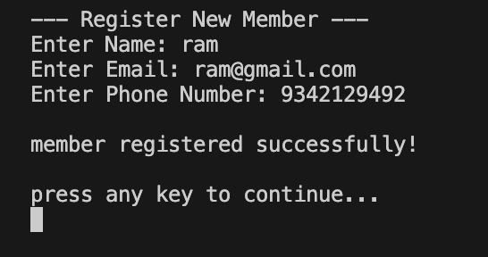

#### Member Profile
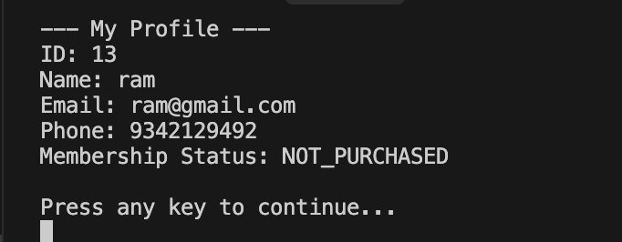

#### Purchase Membership
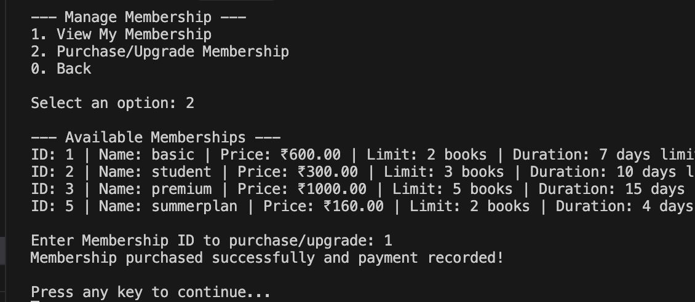

#### Available Books
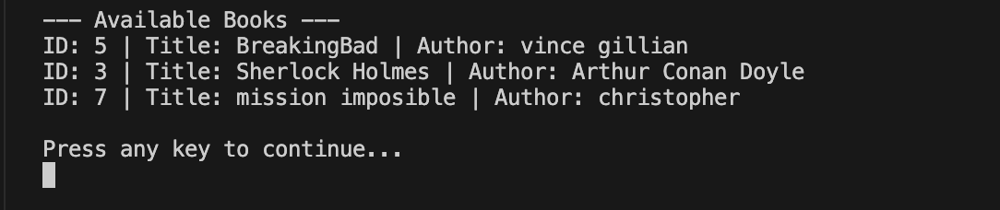

#### Borrow Book
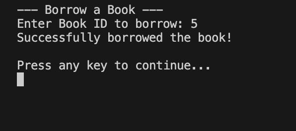

#### Active Borrowings
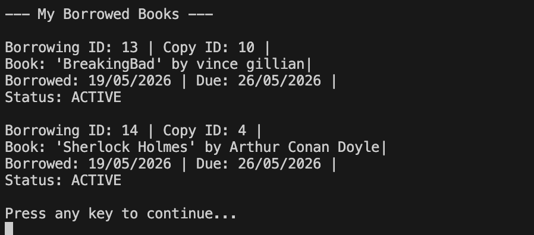

#### Return Book
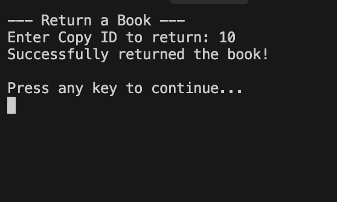

---

### 3. Admin Catalog & Tiers Control

#### Book Management


#### Add Book Copies
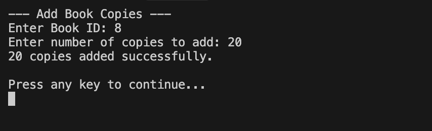

#### Book Copies Listing


#### Membership Menu


#### Create Membership
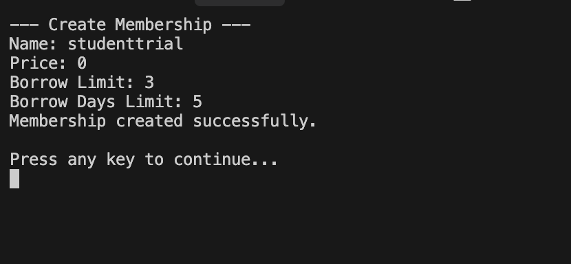

#### Memberships List
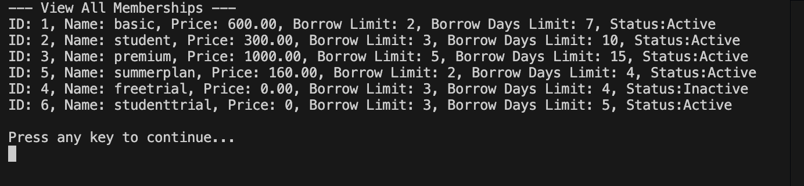

#### Mark Book Damaged
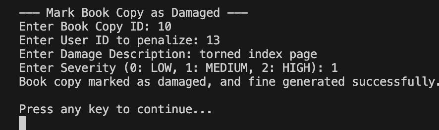

#### Book Damage History
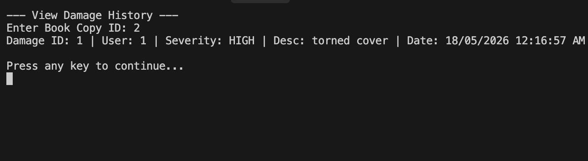

---

### 4. Policy Constraint Warnings

#### Duplicate Borrowing Blocked
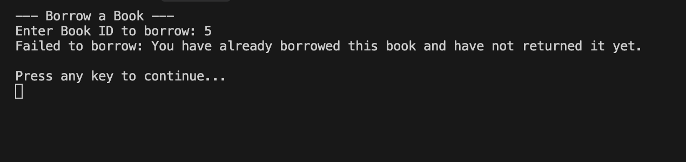

#### Borrow Limit Exceeded
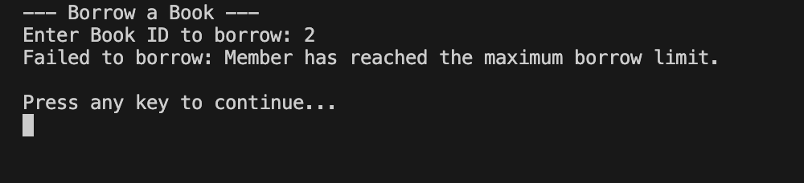

#### Fine Payment Blocked
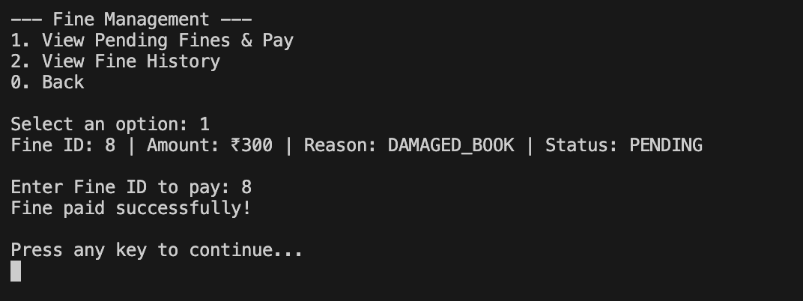

#### Late Return Fine
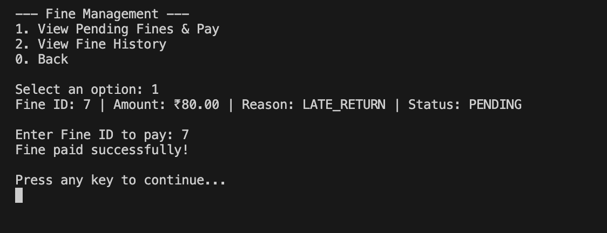

---

### 5. Admin Reports

#### Books Currently Borrowed
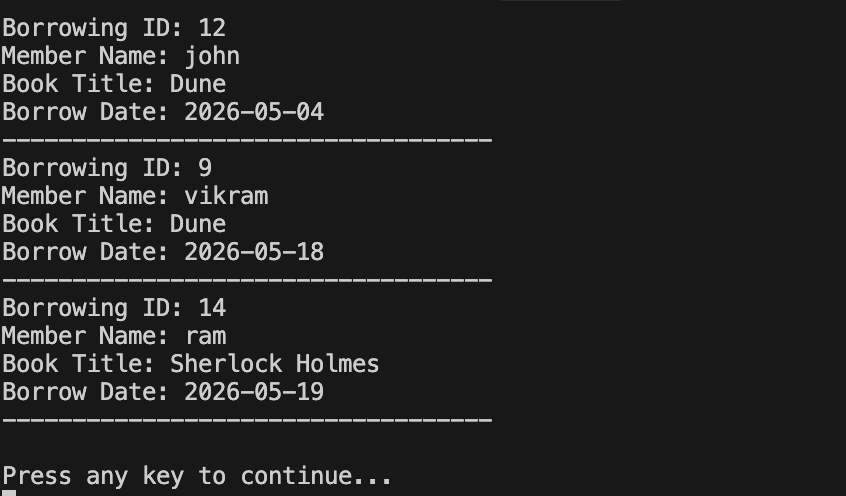

#### Overdue Books
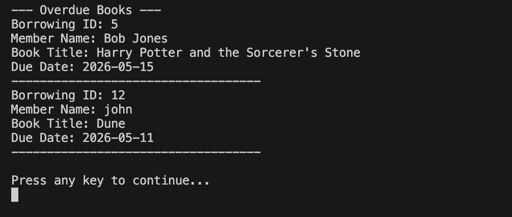

#### Members with Pending Fines
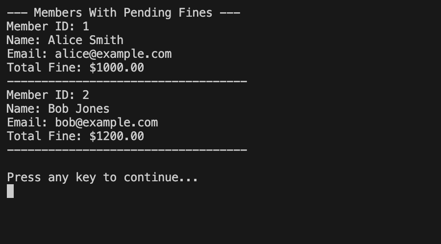

#### Member Borrowing History
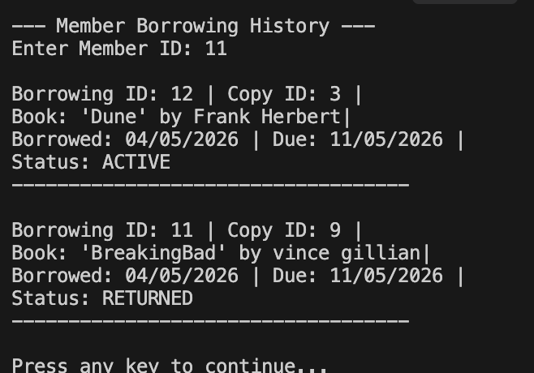

## Verification Logs
For further outputs check [Terminal_output.txt](Terminal_output.txt).
