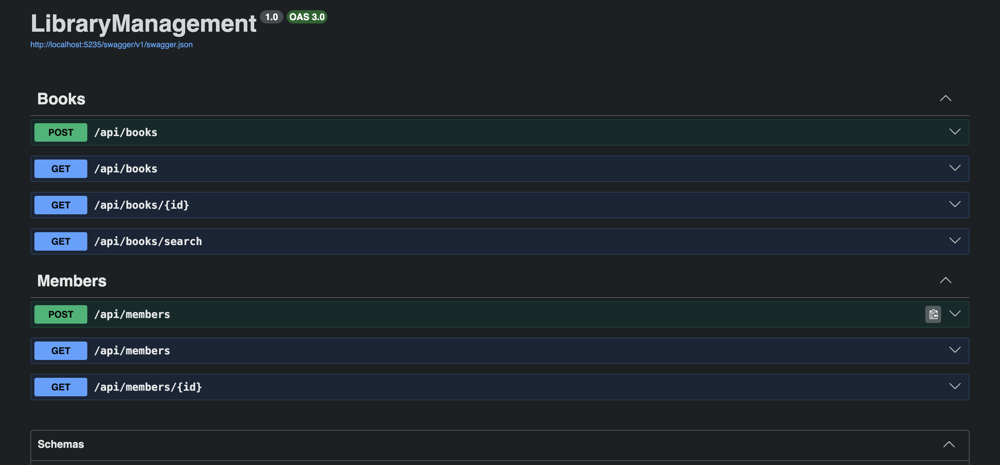
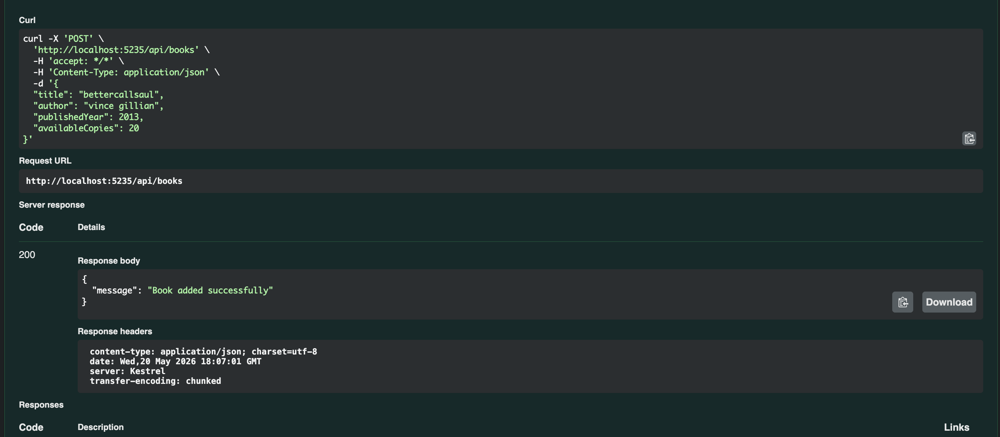
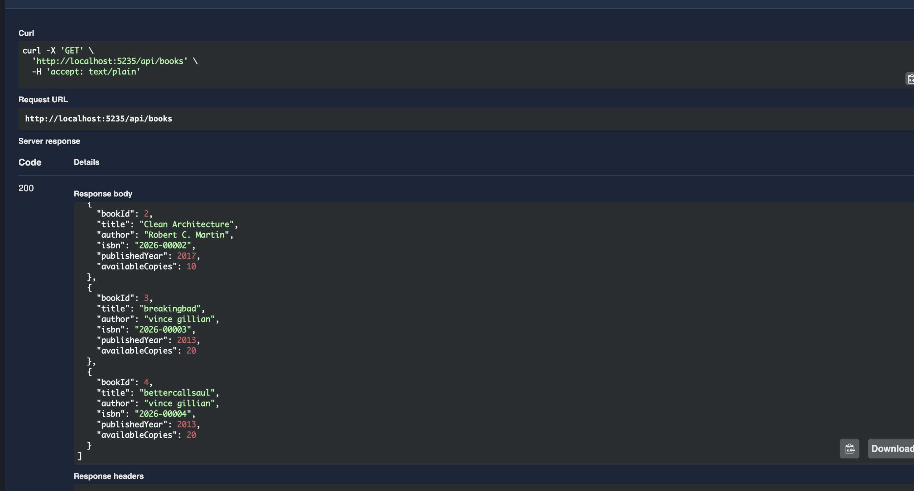
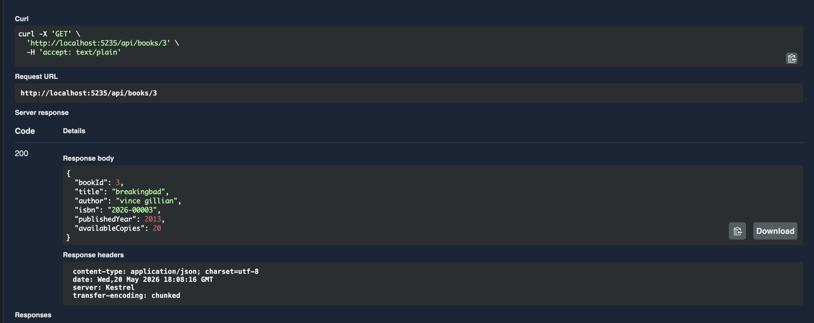
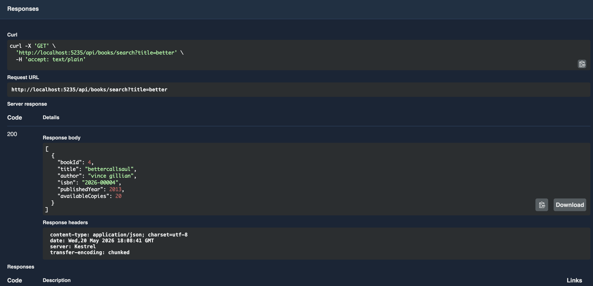
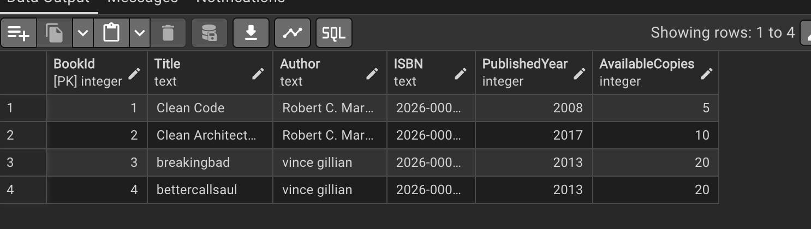
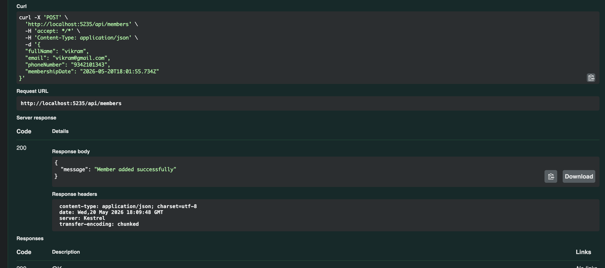
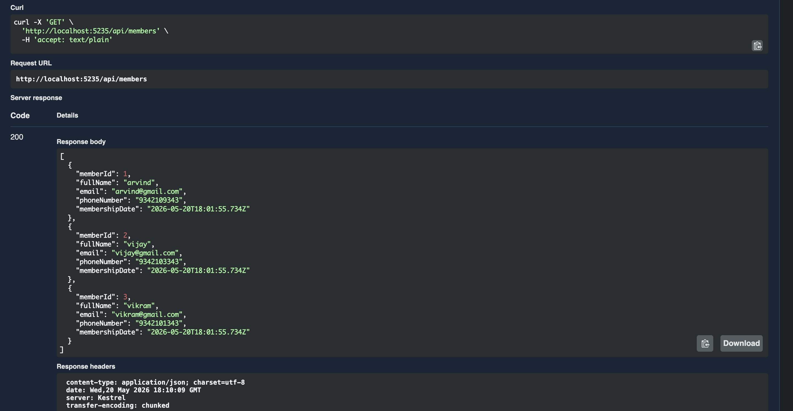
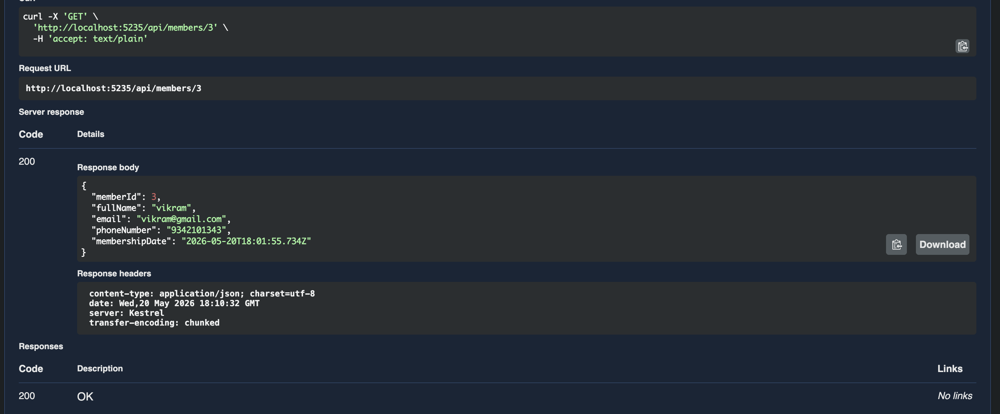
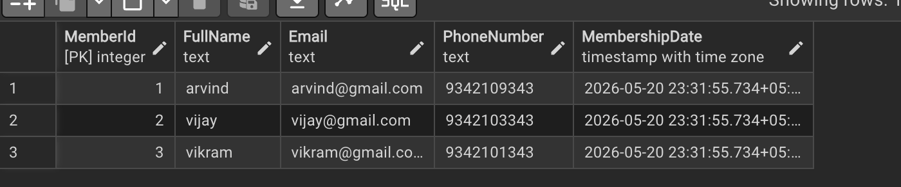

# Library Management System - Output Screenshots

## All API Endpoints

## Add Book

## Get All Books

## Get Book By ID

## Search Book By Title

## Book Table

## Add Member

## Get All Members

## Get Member By ID

## Member Table

