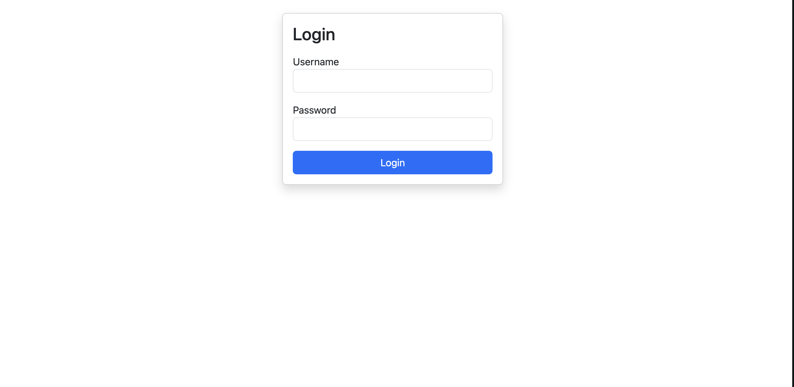
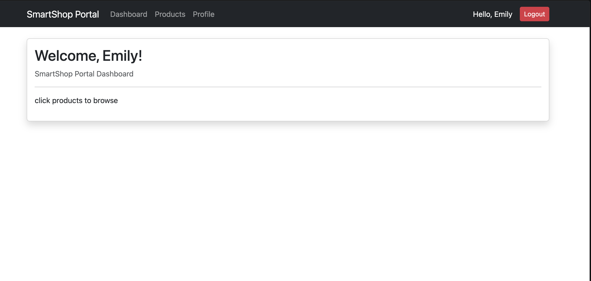
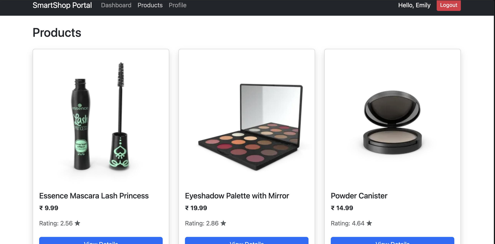
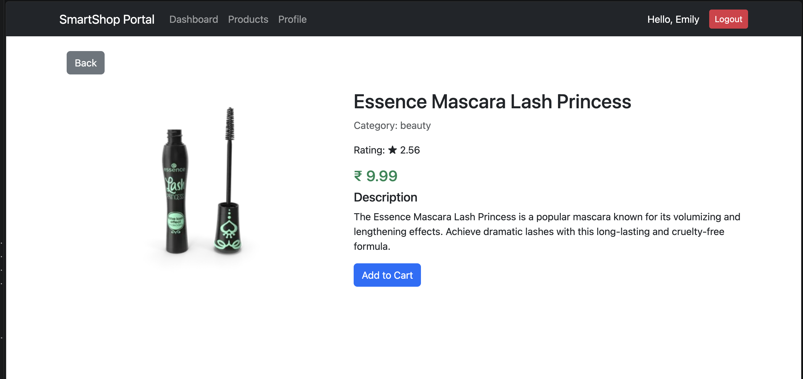
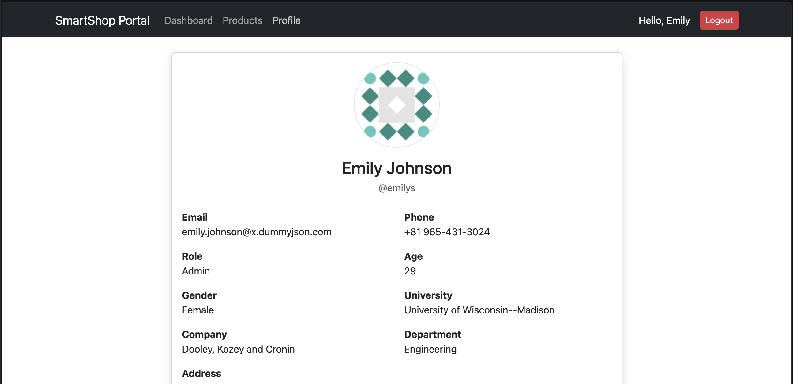

# Frontend

This project was generated using [Angular CLI](https://github.com/angular/angular-cli) version 21.2.13.

## Development server

To start a local development server, run:

```bash
npm i
```

```bash
ng serve
```


### 1. Login Page


### 2. Dashboard


### 3. Product Listing


### 4. Product Details


### 5. User Profile
