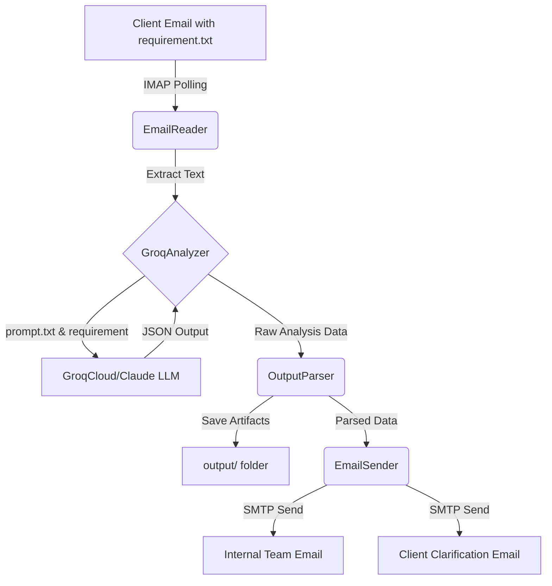
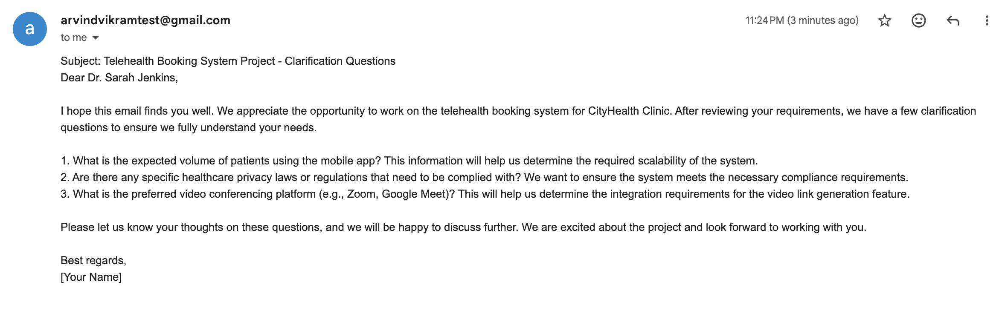
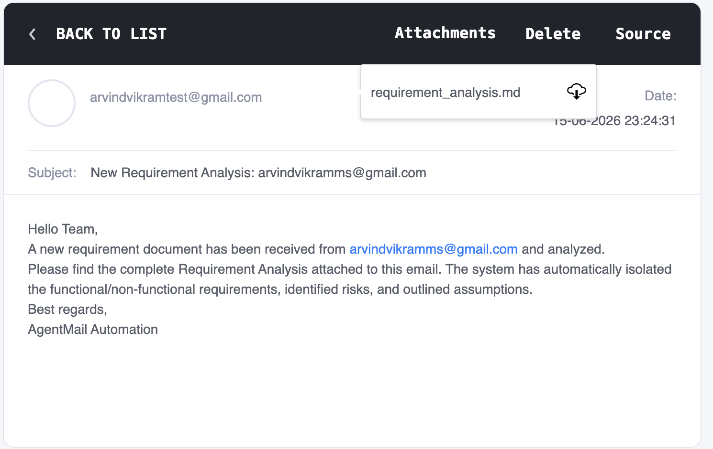

# Automated Requirement Analysis & Email Automation Agent

AgentMail is an automated Python service that monitors a Gmail inbox for client requirements, analyzes them using a Large Language Model (GroqCloud / Claude), generates structured business analysis reports, and automatically dispatches clarification emails to the client and internal reports to the team.

## Deliverables Included
- **Prompt used:** `prompt.txt`
- **Python Script:** Main execution via `main.py`
- **Conversation Engine:** `groq_service.py` 
- **Sample input:** `requirement.txt`
- **Sample output:** See [output/requirement_analysis.md](output/requirement_analysis.md)
- **Screenshots:** Found in the `screenshots` directory.
- **Architecture Diagram:** See below.

## Architecture Diagram Flow



## How to Run

### Prerequisites
1. Python 3.8+
2. A Gmail account with an App Password enabled (for IMAP/SMTP).
3. GroqCloud API Key.

### Setup
1. Clone the repository.
2. Create a virtual environment and activate it:
   ```bash
   python -m venv venv
   source venv/bin/activate  # On Windows use `venv\Scripts\activate`
   ```
3. Install dependencies:
   ```bash
   pip install -r requirements.txt
   ```
4. Configure Environment Variables:
   Create a `.env` file in the root directory and add your credentials:
   ```env
   GROQ_API_KEY=your_groq_api_key
   GMAIL_ADDRESS=your_email@gmail.com
   GMAIL_APP_PASSWORD=your_app_password
   INTERNAL_TEAM_EMAIL=team@example.com
   POLL_INTERVAL=60
   ```

### Execution
Run the main polling service:
```bash
python main.py
```

The service will continuously poll your inbox for unread emails containing a `requirement.txt` attachment, process them, and send out the necessary responses.

## Screenshots

### Client Email Received


### Internal Team Report

